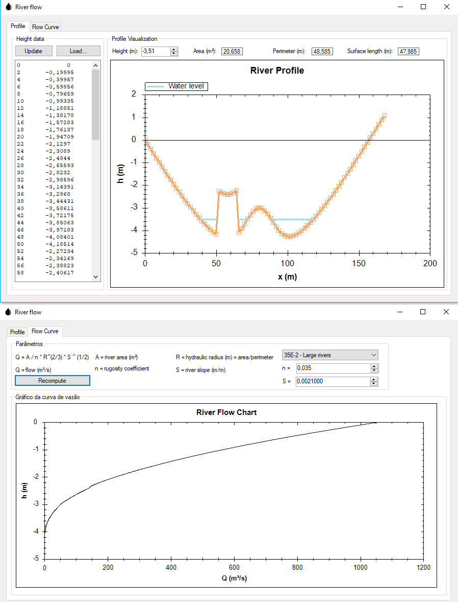

# RiverFlow
Estimation of river flow based on Manning method

Authors:

- Douglas Coimbra de Andrade
- Melina Almeida Gonçalves Rabelo

# Summary

This repository presents code to automate the computation of river flow curve based on Manning method.

Construction of land pipelines involves crossing all types of different terrain, including wet areas and rivers. In the case of rivers, it is important to correctly estimate the water flow and the maximum elevation of flooding to measure the required length of pipeline ballasting and beyond the safe level installation of structures on the river banks.

The flow estimation is often computed based on numerous measurements of area and wetted perimeter from the deformed sections of the rivers, which usually involves an excessive amount of manual labor.

# How to use this code

## Run with your data

- Download Windows binaries [VazaoRio.exe](https://github.com/douglas125/RiverFlow/blob/master/VazaoRio/bin/Debug/VazaoRio.exe?raw=true) and [ZedGraph.dll](https://github.com/douglas125/RiverFlow/blob/master/VazaoRio/bin/Debug/ZedGraph.dll?raw=true) to the same folder. Note: these are binaries, you may be warned not to run/download them. Feel free to download the source and recompile if you prefer;
- Edit height data with `x` (shore distance) and `y` (river height) data OR load from a file;
- You can also copy/paste the data from Excel;
- Visualize the profile in the Profile tab;
- Compute the flow curve in the Flow Curve tab.

## Edit the algorithms

- Download or clone this repository;
- Open in Visual Studio;
- Have fun.
